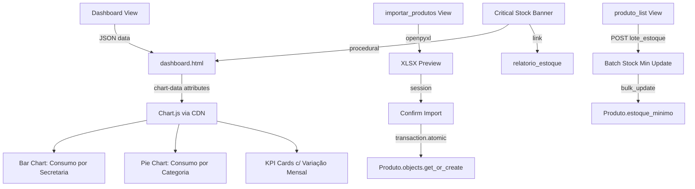

# Analytics & Produtividade Design

**Spec:** `.specs/features/analytics-produtividade/spec.md`
**Status:** Draft

---

## Architecture Overview

Adição de gráficos e operações em lote à app `estoque` existente, sem novos apps, sem novos modelos, sem novas dependências Python. Chart.js carregado via CDN, consistente com Tailwind e Alpine.js já usados.



---

## Code Reuse Analysis

### Existing Components to Leverage

| Component | Location | How to Use |
| --- | --- | --- |
| `_base.py` imports | `estoque/views/_base.py` | Reuse all model imports, helpers (`_to_decimal`, `_export_csv`), decorators (`login_required`, `_tem_papel`) |
| `importar_licitacao` pattern | `estoque/views/relatorios.py:336-456` | Same upload→preview→confirm flow with session storage |
| `relatorio_movimento` aggregations | `estoque/views/relatorios.py:20-86` | `ItemPedido.objects.filter(pedido__status="ENTREGUE").values(...).annotate(...)` pattern |
| `produto_list` Alpine.js modal | `templates/estoque/produto_list.html` | Reuse `x-data`, `x-show`, modal structure for batch stock min |
| CSS design tokens | `static/css/design-tokens.css` | All new UI uses existing CSS vars (`.window-panel`, `.action-btn`, `.section-box`) |
| `_tem_papel` decorator | `estoque/views/_base.py:43-54` | Restrict batch import to "Almoxarife", "Comprador", "Administrador" |

### Integration Points

| System | Integration Method |
| --- | --- |
| Dashboard template | Inline `<script>` with Chart.js rendering from `data-chart-*` attributes or inline JSON |
| base.html | Add `<script src="https://cdn.jsdelivr.net/npm/chart.js@4.4.7/dist/chart.umd.min.js">` |
| Existing relatorio_estoque | Banner link: `?apenas_criticos=1` |
| openpyxl | Already in `pyproject.toml`; use for batch product import (same as licitation import) |

---

## Components

### 1. Dashboard View Enhancement

- **Purpose:** Computar dados de gráficos e KPIs com variação mensal, serializar para JSON
- **Location:** `estoque/views/dashboard.py` (modify existing)
- **New queries added:**
  - `_chart_consumo_secretaria()` — `ItemPedido.objects.filter(pedido__status="ENTREGUE", pedido__data_pedido__date__gte=6_months_ago).values("mes", "secretaria__nome").annotate(total=Sum("quantidade"))` → dict `{labels: [...], datasets: [{label: "Secretaria X", data: [...]}]}`
  - `_chart_consumo_categoria()` — `ItemPedido.objects.filter(pedido__status="ENTREGUE").values("produto__categoria__nome").annotate(total=Sum("quantidade"))` → dict `{labels: [...], data: [...]}`
  - `_kpi_variance()` — Compare current month vs previous month for: pedidos criados, entradas criadas, itens consumidos → dict `{label, current, previous, percent, direction}`
- **Dependencies:** `from django.db.models.functions import TruncMonth` (new import), `from datetime import date, timedelta`
- **Reuses:** `_base.py` model imports, `render`, `login_required`

### 2. Chart.js Integration

- **Purpose:** Renderizar gráficos de barras e pizza no dashboard
- **Location:**
  - `templates/base.html` — adicionar `<script>` CDN
  - `templates/estoque/dashboard.html` — inline script que lê `data-chart-*` attributes e instancia Chart.js
- **Interfaces:** Elementos `data-chart-consumo='{{ chart_data_json|safe }}'` e `data-chart-categoria='{{ chart_data_json|safe }}'` em `<canvas>` wrappers
- **Dependencies:** Chart.js 4.4.7 via CDN
- **Edge case:** Se `chart_data_json` for `"{}"`, exibir "Sem dados no período"

### 3. Batch Product Import

- **Purpose:** Upload de planilha XLSX com produtos, preview, confirmação e criação
- **Location:**
  - `estoque/views/importar_produtos.py` (new file)
  - `templates/estoque/importar_produtos.html` (new file)
- **Flow:**
  1. GET → renderiza form de upload
  2. POST com `arquivo` + `confirmar=""` → processa XLSX, salva preview na session, renderiza preview
  3. POST com `confirmar="1"` → lê da session, cria produtos via `Produto.objects.get_or_create(nome=...)`, mensagem de sucesso
- **Colunas esperadas:** A=Nome, B=Categoria (nome), C=Unidade (UN/CX/KG/LT/PCT/RM), D=Estoque Mínimo
- **Interfaces:**
  - `importar_produtos(request: HttpRequest) -> HttpResponse`
- **Dependencies:** openpyxl, `_tem_papel`, `transaction.atomic()`
- **Reuses:** Session-storage pattern from `importar_licitacao`, `_tem_papel` decorator

### 4. Batch Stock Minimum Update

- **Purpose:** Atualizar `estoque_minimo` de múltiplos produtos de uma vez
- **Location:**
  - View handler in `estoque/views/produtos.py` (new endpoint)
  - Modal in `templates/estoque/produto_list.html` (extends existing template)
- **Flow:**
  1. Usuário seleciona produtos via checkbox na listagem
  2. Clica "Lote Estoque Mín" → modal abre com campo único de valor
  3. Confirma → POST com `[produto_ids]` e `estoque_minimo` → `Produto.objects.filter(pk__in=ids).update(estoque_minimo=valor)`
- **Interfaces:**
  - `produto_lote_estoque(request: HttpRequest) -> HttpResponse` (POST only, redirects to `produto_list`)
- **Dependencies:** `_tem_papel`, template refactor (add checkbox column)

### 5. Critical Stock Banner

- **Purpose:** Banner destacado no topo do dashboard quando há itens críticos
- **Location:** `templates/estoque/dashboard.html` — bloco condicional no topo de ``
- **Logic:**
  ```django
  
    <div class="themed-attention ...">
      ⚠ {{ estoque_critico_count }} produto(s) abaixo do estoque mínimo
      <a href="?apenas_criticos=1">Ver itens críticos</a>
    </div>
  
    <div class="section-box ...">
      ✅ Estoque regular — sem itens críticos
    </div>
  
  ```
- **Dependencies:** `estoque_critico_count` context variable (já computado: `estoque_critico.count()`)

---

## Data Models

Nenhum modelo novo necessário. Todas as consultas usam modelos existentes:
- `ItemPedido` + `Pedido` — base para agregações de consumo
- `Produto` — alvo das operações em lote
- `Categoria` — agrupamento dos gráficos de pizza
- `Unidade` (secretaria) — agrupamento dos gráficos de barra

---

## Error Handling Strategy

| Error Scenario | Handling | User Impact |
| --- | --- | --- |
| Planilha vazia (só cabeçalhos) | Preview mostra "Nenhum produto encontrado na planilha" | Mensagem clara, sem ação |
| Linha com nome vazio | Skip da linha no preview | Linha ignorada, processa as outras |
| Linha com unidade inválida | Default para "UN" | Produto criado com unidade padrão |
| Linha com estoque mínimo não numérico | Default para 0 | Produto criado com mínimo 0 |
| Categoria não existe | `Categoria.objects.get_or_create(nome=...)` | Categoria criada automaticamente |
| Produto duplicado (nome exato) | `get_or_create` — skip | Produto existente preservado |
| Arquivo não .xlsx | `messages.error` | Usuário vê alerta |
| openpyxl LoadError | `messages.error` com detalhe | Usuário vê erro, tenta novamente |
| Chart.js CDN indisponível | Canvas vazio com fallback "Gráficos indisponíveis" | Dashboard funcional sem gráficos |

---

## Tech Decisions

| Decision | Choice | Rationale |
| --- | --- | --- |
| Chart.js vs Chart.js embedded | CDN (`jsdelivr.net`) | Consistente com Tailwind/Alpine.js CDN; sem build step |
| Dados de gráfico no template vs API | Inline JSON no template | Sem endpoints extras; simples, sem latência adicional |
| Batch import via session vs DB temp table | Django session | Igual ao padrão `importar_licitacao`; sem modelo temporário |
| Batch stock min: checkbox vs select all | Checkbox individual + select all toggle | Alpine.js já disponível; sem dependências novas |
| KPI variance: mês atual vs anterior | `TruncMonth` + `date.today()` | Preciso o suficiente; sem necessidade de cache |
| Template de importação: novo arquivo vs reutilizar | `importar_produtos.html` dedicado | Layout diferente da licitação (colunas diferentes, sem proponentes) |
